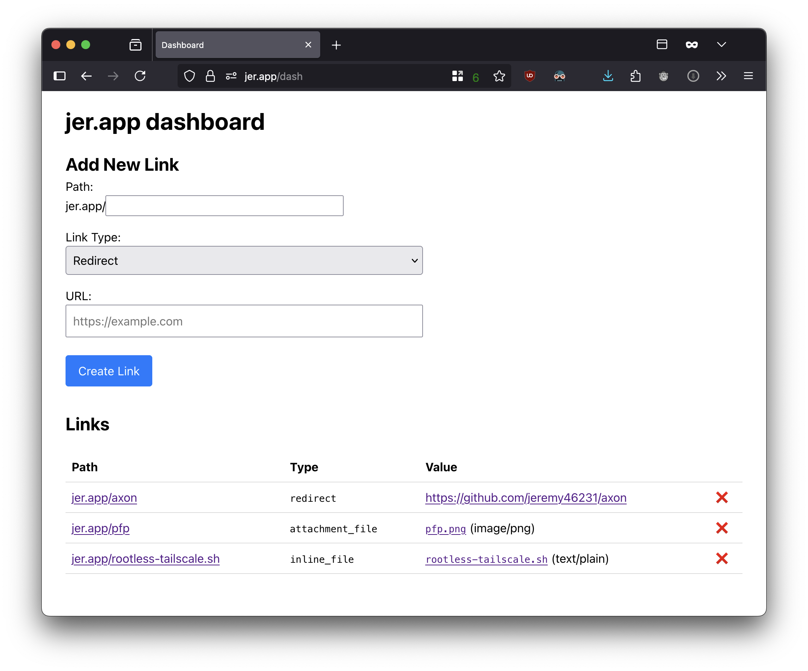

# jer.app

A personal link shortener and free file-hosting service, built to run on the
Cloudflare edge. It's super easy to deploy and requires no API keys.

## What it is

`jer.app` is a self-hosted, easy-to-deploy service for managing short links and
file shares. It's built on the principle of providing a free, easy-to-deploy
tool with full control over your links, using multiple storage backends that
require **no API keys**. It all runs on a free Cloudflare Worker and D1
database.

Because you control the code and the domain, you have complete ownership. The
service can create three types of links:

- **Redirects:** `your.domain/repo` -> `https://github.com/your/repo`
- **File uploads:** `your.domain/screenshot.png` -> Serves any uploaded file.
- **Text snippets:** `your.domain/install.sh` -> Allows you to paste text
  snippets, as an alternative to file uploads.

Files are hosted with customizable `Content-Type` and `Content-Disposition`
headers, so you can control how the file is interpreted, what its filename is,
and whether the browser forces a download. They are proxied through the Worker
from their source, so the URL is clean and accessible from anywhere. Files can
be stored in a variety of free backends:

| Location                                             | Max Size  | Persistence         | Use Case                                                                                                                   |
| :--------------------------------------------------- | :-------- | :------------------ | :------------------------------------------------------------------------------------------------------------------------- |
| **Inline in DB**                                     | 5GB Total | **Permanent**       | Directly in the database, fast and reliable.                                                                               |
| [**Catbox**](https://catbox.moe)                     | 200MB     | **Permanent**       | Permanent hosting for medium-sized files.                                                                                  |
| [**Litterbox**](https://litterbox.catbox.moe)        | 1GB       | **Temporary (72h)** | Large files that expire after 72 hours.                                                                                    |
| [**Gofile**](https://gofile.io)                      | Unlimited | **Temporary**       | "Unlimited" storage for very large, temporary files. Reverse engineered, so it doesn't require premium or even an account. |
| [**Hack Club CDN**](https://github.com/hackclub/cdn) | 70KB\*    | **Permanent**       | Hosting for tiny, permanent assets.                                                                                        |

\*In the future, it may support unlimited filesize, but we have to use a
technical hack that limits the size to 70KB for now.

## Deploy your own!

Cloudflare makes it super easy to deploy a working app in literally 56 seconds
(yes, from clicking the button to being on the deployed app, I timed it :D).
Just follow these steps:

1. Click the "Deploy to Cloudflare" button above, and sign into Cloudflare if
   needed.
2. Optionally, tweak the project name, database name, or the Git repository that
   Cloudflare will create for you. All other settings can be left as-is.
3. Click "Create and deploy" at the bottom.
4. Wait 30 seconds (yep, I timed it) until you see the "Success! Your project is
   deployed to Region: Earth" header.
5. You're done! The project is now available at the URL on screen.

By default, the project will be available at a long `.workers.dev` domain, the
dashboard will be available with no authentication, and the root URL will
redirect to the dashboard. You can configure this by setting variables in
Cloudflare:

1. Navigate to your project on Cloudflare. (If you just deployed, click
   "Continue to project".)
2. Under the "Settings" tab, find the "Variables and Secrets" section.
3. To add authentication, create two Secret variables named `ADMIN_USERNAME` and
   `ADMIN_PASSWORD`.
4. To change where the root URL redirects, create a Text variable named
   `REDIRECT_URL`.
5. To add a custom domain:
   1. Scroll up to the "Domains & Routes" section and click "Add".
   2. Select "Custom domain" and enter the domain or subdomain you want to use.
   3. Click "Add domain". If you own the domain on Clouflare, it will be set up
      automatically. If not, follow the instructions to set up DNS records.

## License

This project is licensed under the MIT License. See the [LICENSE](LICENSE) file
for details.

## Contributing

Pull requests are welcome. This is a personal project, so for major changes, you
might be better off forking (though I'd love to look at whatever you make!). For
bug fixes and small improvements, feel free to open a PR.
